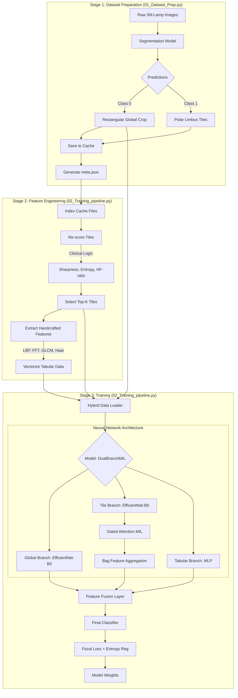

# Model 1: Hybrid MIL-Tabular Training Pipeline

This directory contains the pipeline for training a universal model using a combination of deep learning features, Multi-Instance Learning (MIL) for tiles, and handcrafted tabular features.

## Data Flow Diagram

## Detailed Process Breakdown

### 1. Dataset Preparation (`01_Dataset_Prep.py`)
*   **Input**: Raw medical images from `DatasetSatyam`.
*   **Segmentation**: Uses a U-Net++ model to identify the `Crop` (general ROI) and `Limbus` (eye structure).
*   **Global Crop**: Extracts a binary rectangular area around the limbus.
*   **Tiling**: Performs polar slicing to create circular wedges (tiles) centered on the eye.
*   **Caching**: Saves everything into a precomputed folder to avoid redundant computation during training.

### 2. Feature Engineering & Quality Assessment
*   **Clinical Scoring**: Tiles are evaluated for:
    *   **Sharpness**: Laplacian variance.
    *   **Texture**: Local entropy and LBP (Local Binary Patterns).
    *   **Frequency**: FFT high-frequency ratio to detect fine details.
*   **Handcrafted Features**: Extracts high-level statistical features from both the global image and the best-performing tiles, including:
    *   **Texture**: GLCM Contrast, Haar Wavelet energies.
    *   **Color**: LAB and HSV color space statistics.
    *   **Shape**: Roundness, Elongation, and Solidity of the cropped region.

### 3. Model Architecture (`DualBranchMIL_WithFeatures`)
The model is a **tri-modal fusion architecture**:
1.  **Global Branch**: Processes the entire cropped eye to capture context.
2.  **Tile Branch (MIL)**: Processes multiple small tiles to find localized pathologies. It uses an **Attention mechanism** to learn which tiles are most important for the diagnosis.
3.  **Tabular Branch**: Processes the handcrafted feature vector directly through an MLP (Multi-Layer Perceptron), providing traditional computer vision insights to the deep learning model.

### 4. Training Objectives
*   **Focal Loss**: Used to handle class imbalance (e.g., differentiating rare infections from normal cases).
*   **Attention Entropy**: Penalizes the model if it focuses on too many tiles at once, encouraging it to find clear, diagnostic "evidence."
