# 🏗️ Keratitis Detection System: Technical Architecture

This document provides a detailed overview of the V5 "Expert System" architecture, describing the complete journey from raw image input to final diagnostic prediction.

---

## 🔄 1. Data Flow & Pre-computation Pipeline

The system uses a highly optimized pre-computation pipeline to accelerate training and ensure inference consistency.

```mermaid
graph TD
    A["📸 Raw Slit-Lamp Image"] --> B["🧠 Segmentation Model (U-Net++)"]
    B --> C["📐 ROI Extraction (Crop Box)"]
    B --> D["📍 Limbus Center Detection"]
    
    C --> E["🌍 Global ROI (384x384)"]
    D --> F["💠 Polar Coordinate Transform"]
    
    F --> G["🧩 Polar Tiles (24 Tiles)"]
    G --> H["⚖️ Clinical Quality Scoring (Beta-Bias)"]
    
    E & G --> I["📊 Tabular Feature Extraction"]
    I --> J["📝 feat_mu.npy / feat_sigma.npy"]
    
    H & I & E & G --> K["💾 Pre-computed Cache (DatasetSatyam_Precomputed1)"]
    K --> L["🚀 MIL Model Training / Inference"]
```

### Key Stages:
1.  **Segmentation**: Uses a U-Net++ with EfficientNet-B0 backbone to identify the corneal region (Crop) and Limbus.
2.  **Global ROI**: The cropped corneal area used for high-level context.
3.  **Polar Tiles**: The limbus is divided into 24 tiles (3 rings, 8 sectors) to focus on localized keratitis patterns.
4.  **Clinical Scoring**: Tiles are scored based on **Laplacian Variance (sharpness)**, **Entropy**, and **Opacity**, penalizing **Glare** and **Border-edges**.
5.  **Tabular Features**: Extract 70+ hand-crafted features (LBP, Wavelets, GLCM, FFT) from both global and local views.

---

## 🧬 2. Dual-Branch MIL Architecture

The V5 model integrates three distinct sources of evidence: Global context, Local patch-level details, and Statistical tabular features.

```mermaid
graph LR
    subgraph "Branch 1: Global context"
        G1["Global ROI"] --> G2["EfficientNet-B0"]
        G2 --> G3["Global Projector (256)"]
    end

    subgraph "Branch 2: Local Evidence (MIL)"
        L1["Polar Tiles (1..24)"] --> L2["EfficientNet-B0 (Shared)"]
        L2 --> L3["Tile Projector (256)"]
        L3 --> L4["Gated Soft Attention"]
        L4 --> L5["Bag Feature (256)"]
    end

    subgraph "Branch 3: Statistical Branch"
        S1["Tabular Features"] --> S2["Standardization (Batch Norm)"]
        S2 --> S3["MLP (128)"]
    end

    G3 & L5 & S3 --> F1["➕ Feature Fusion (Concatenation)"]
    F1 --> C1["🏥 Final Classifier"]
    C1 --> O1["🎯 Class Probabilities"]
```

### Architecture Components:
-   **Local Branch (MIL)**: Uses **Soft Gated Attention** to weigh patches. It learns which tiles contain the most significant disease evidence (e.g., an active infection site gets higher weight).
-   **Global Branch**: Captures overall eye appearance and orientation.
-   **Tabular Branch**: Provides explicit mathematical descriptors (e.g., scarring textures or edema patterns) that deep learning might miss.
-   **Soft Pooling**: Unlike Max-Pooling, Soft Attention considers all tiles but focuses heavily on the "Expert-selected" ones.

---

## 🛠️ 3. Execution Roles

| Script | Purpose |
| :--- | :--- |
| `01_Dataset_Prep.py` | Performs the heavy lifting: Segmentation, Polar transform, and Feature extraction. |
| `05_NewTraining.py` | Trains the Dual-Branch MIL model using the pre-computed cache. |
| `06_NewTest_Batch.py` | Runs high-speed batch inference on folders of raw images. |
| `07_modelUI_updated.py` | The main interactive Expert UI for single-image diagnosis. |
| `08_batchUI.py` | Streamlit interface for batch processing raw data. |

---

> [!NOTE]
> All path handling in these scripts has been updated to use **Robust Absolute Pathing**, ensuring the system works seamlessly on Streamlit Cloud and different operating systems.
